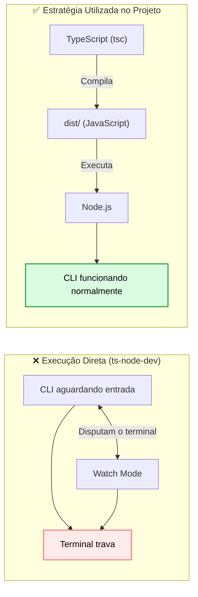
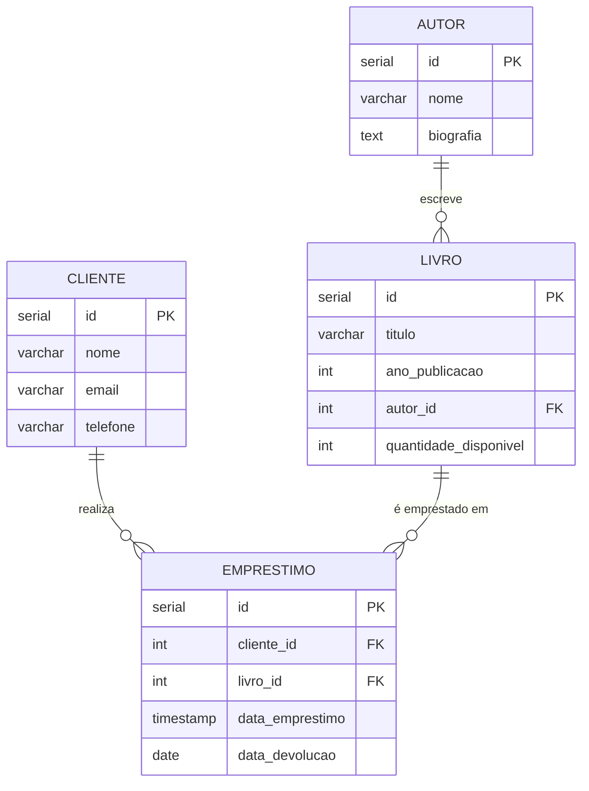

# BookStore Manager - CLI

## Objetivo e restrições

Desenvolvi este projeto como um aplicativo interativo de linha de comando (CLI) voltado para o gerenciamento de uma livraria/biblioteca que controla os fluxos de autores, livros, clientes e empréstimos. Construí este software como um exemplo de referência arquitetural: meu objetivo principal foi modelar um desenho limpo, modular e robusto, aplicando boas práticas de engenharia de software e padrões reais de mercado.

Três grandes restrições e guias moldaram minhas decisões:

1. **TypeScript sobre Node.js:** Uso total do ecossistema moderno com forte tipagem e compilação via `tsc`, utilizando drivers nativos para comunicação de infraestrutura.
2. **Desenvolvimento em Camadas Estritas:** Separação rígida de responsabilidades, garantindo que o acoplamento seja controlado e que componentes de infraestrutura (banco de dados) possam ser substituídos sem impactar o core do negócio.
3. **Tratamento de Exceções de Domínio:** Bloqueio e blindagem contra falhas técnicas expostas diretamente na interface, garantindo tratamento de erros em nível de negócio antes que alcancem o banco de dados.

---

## Como rodar

```bash
# 1. Instalar as dependências do projeto
npm install

# 2. Compilar o TypeScript para JavaScript (Build)
npm run build

# 3. Iniciar o aplicativo CLI
npm start

```

### Variáveis de Ambiente

O aplicativo se conecta a um banco de dados relacional. Configurei um arquivo `.env` na raiz do projeto contendo as credenciais do meu ambiente PostgreSQL:

```env
DB_USER=seu_usuario
DB_HOST=seu_host
DB_DATABASE=bookstore
DB_PASSWORD=sua_senha
DB_PORT=5432

```

### Criando as tabelas no banco

Antes de iniciar a aplicação, crie o banco `bookstore` no PostgreSQL e execute o script disponível em `src/database/schema.sql` para criar as tabelas (`autor`, `livro`, `cliente`, `emprestimo`) e as chaves estrangeiras entre elas:

```bash
psql -U seu_usuario -d bookstore -f src/database/schema.sql
```

### Lições Aprendidas: Conflito entre `ts-node-dev` e aplicações CLI

Durante o desenvolvimento, identifiquei que ferramentas de execução em tempo real, como o **ts-node-dev**, não se comportam bem em aplicações de Linha de Comando (CLI). Como a aplicação permanece aguardando a entrada do usuário, o processo de _watch mode_ passa a disputar o controle do terminal, podendo causar travamentos e comportamentos inesperados.

Para evitar esse problema, optei por separar as responsabilidades: o **TypeScript** realiza apenas a compilação do projeto e o **Node.js** executa exclusivamente o código JavaScript gerado.



---

## 1. Arquitetura em Camadas e Injeção de Dependências

O fluxo do meu sistema respeita uma hierarquia estrita entre as camadas, onde cada componente possui uma responsabilidade única e se comunica estritamente com a camada imediatamente abaixo através de acoplamentos limpos. Realizei a amarração das instâncias manualmente no ponto de entrada do sistema:

```
View (Menus) → Controller → Service (Regras de Negócio) → Repository (Persistência / Banco)

```

| Camada            | Responsabilidade                                                                                    | Diretório Correspondente |
| ----------------- | --------------------------------------------------------------------------------------------------- | ------------------------ |
| **Views / Menus** | Todo o Input e Output (I/O) de console, exibição de opções e laços de tela.                         | `src/menus/`             |
| **Controllers**   | Repasse fino dos dados capturados na tela para a camada interna, sem lógica de negócio.             | `src/controllers/`       |
| **Services**      | Core do sistema: onde residem todas as regras de negócio, cálculos e validações estritas.           | `src/services/`          |
| **Repositories**  | Persistência física de dados, responsável pelo isolamento e execução das queries SQL no PostgreSQL. | `src/repositories/`      |
| **Models**        | Definições das entidades de negócio tipadas e estruturais do sistema.                               | `src/models/`            |

Toda a montagem e amarração do grafo de dependências ocorre no ponto de entrada principal do meu projeto (`src/main.ts`), que atua como a **Raiz de Composição (Composition Root)**. Os objetos são criados e injetados de baixo para cima, garantindo o desacoplamento recomendado pelo princípio de inversão de dependência.

---

## 2. Política de Erros e Validações de Domínio (RF08, RF10, RF11 e RF13)

Seguindo o princípio de que o banco de dados não deve ditar regras de negócio na interface exibindo erros técnicos de infraestrutura, implementei uma camada de validações na **Services**:

### 1. Validação de Vínculos e Integridade (RF08)

Ao cadastrar ou atualizar um livro (`livroService`), o sistema verifica ativamente no repositório se o `autorId` informado realmente existe. Se o autor não for encontrado, o fluxo é interrompido imediatamente com uma exceção de negócio. Isso evita chamadas desnecessárias ao banco de dados e impede que o PostgreSQL precise rejeitar a transação por falha de chave estrangeira (Foreign Key).

### 2. Validação Tripla de Empréstimos (RF10)

Antes de consolidar um empréstimo na base de dados, a função `cadastrarEmprestimo` realiza três validações consecutivas cruciais:

1. Verifica se o livro de fato existe no acervo.
2. Verifica se o cliente informado existe na tabela de clientes.
3. Avalia se há quantidade disponível no estoque para a saída.

### 3. Fluxo Estrito de Devoluções e Reposição de Estoque (RF11)

Ao registrar a devolução de um exemplar (`emprestimoService`), o sistema opera sob uma política rígida de duas etapas integradas em nível de persistência:
1. Localiza o registro do empréstimo ativo e calcula a baixa definindo a data de encerramento, garantindo integridade sobre o histórico.
2. Dispara a reposição automática da quantidade em estoque do livro devolvido diretamente na tabela correspondente, mantendo o balanço físico síncrono com a realidade do acervo.

### 4. Mensagens Amigáveis ao Usuário (RF13)

Todas as falhas de domínio listadas acima capturam as exceções de negócio e lançam erros amigáveis ao usuário final. Isso impede que mensagens ou logs técnicos do driver do PostgreSQL (como erros críticos de _Foreign Key Violation_) vazem para a interface, assegurando um comportamento limpo e legível na CLI.

### 5. Revalidação e Proteção contra Duplicidade em Atualizações

Estendi os critérios de segurança de e-mail na camada de clientes (`clienteService`). Tanto no cadastro quanto na atualização, uma checagem dupla é aplicada: formato válido (exigência de `@`) e unicidade na base. Na edição, a lógica permite que o cliente mantenha o próprio e-mail, mas barra imediatamente o fluxo caso ele tente alterar seus dados para um e-mail que já pertença a outro ID cadastrado no sistema.

---

## 3. Estrutura do Banco de Dados Relacional

A camada de persistência foi implementada em **PostgreSQL**, escolhido pela robustez, confiabilidade e amplo suporte ao padrão SQL. O esquema foi planejado com o apoio do **DB Designer** para validar entidades e relacionamentos antes da implementação física, e toda a criação e inspeção das tabelas foi feita via **pgAdmin 4** durante o desenvolvimento.

A modelagem segue os princípios da **3ª Forma Normal (3FN)**, reduzindo redundâncias e garantindo integridade referencial por meio de **Primary Keys** e **Foreign Keys**. O diagrama abaixo reflete exatamente as tabelas criadas pelo script `src/database/schema.sql`:



### Relacionamentos

| Entidade                 | Descrição                                                                                | Cardinalidade |
| ------------------------ | ---------------------------------------------------------------------------------------- | ------------- |
| **Autor → Livro**        | Um autor pode escrever vários livros; cada livro pertence a um único autor (`autor_id`). | 1:N           |
| **Cliente → Empréstimo** | Um cliente pode realizar vários empréstimos ao longo do tempo.                           | 1:N           |
| **Livro → Empréstimo**   | Um mesmo livro pode ser emprestado várias vezes, em momentos diferentes.                 | 1:N           |

### Considerações de modelagem

- As tabelas foram separadas por entidade para evitar redundância e facilitar manutenção.
- Toda relação entre tabelas é protegida por **Foreign Keys** (`autor_id`, `cliente_id` e `livro_id` no script SQL), garantindo integridade referencial no próprio banco.
- Regras de negócio (existência de autor/cliente, disponibilidade em estoque) são responsabilidade da camada **Services**; o banco garante apenas a consistência estrutural dos dados.

---

## 4. Mapa do Código

```
bookstore-manager-cli/
├── src/
│   ├── main.ts                         # Ponto de entrada e Composition Root (amarração do sistema)
│   ├── controllers/                    # Intermediários finos entre a View (Menus) e o Domínio (Services)
│   │   ├── autorController.ts
│   │   ├── clienteController.ts
│   │   ├── emprestimoController.ts
│   │   ├── livroController.ts
│   │   └── relatorioController.ts
│   ├── database/                       # Camada de configuração e scripts de banco de dados
│   │   ├── connection.ts               # Pool de conexões do driver node-postgres (pg)
│   │   └── schema.sql                  # Script DDL de criação física das tabelas e chaves estrangeiras
│   ├── menus/                          # Camada de Interface (View): Gerenciamento de telas e readline
│   │   ├── autorMenu.ts
│   │   ├── clienteMenu.ts
│   │   ├── emprestimoMenu.ts
│   │   ├── livroMenu.ts
│   │   └── relatorioMenu.ts
│   ├── models/                         # Definições de Entidades e Interfaces de tipagem estrutural do TypeScript
│   │   ├── autor.ts
│   │   ├── cliente.ts
│   │   ├── emprestimo.ts
│   │   ├── livro.ts
│   │   └── relatorio.ts
│   ├── repositories/                   # Camada de Infraestrutura: Execução de queries SQL cruas no PostgreSQL
│   │   ├── autorRepository.ts
│   │   ├── clienteRepository.ts
│   │   ├── emprestimoRepository.ts
│   │   ├── livroRepository.ts
│   │   └── relatorioRepository.ts
│   ├── services/                       # Camada Core: Concentra todas as regras de negócio e validações
│   │   ├── autorService.ts
│   │   ├── clienteService.ts
│   │   ├── emprestimoService.ts
│   │   ├── livroService.ts
│   │   └── relatorioService.ts
│   └── utils/                          # Helpers globais e funções utilitárias compartilhadas no sistema (vazio)
├── package.json                        # Gerenciador de dependências e scripts de execução (build/start)
└── tsconfig.json                       # Configurações do compilador TypeScript (tsc)

```